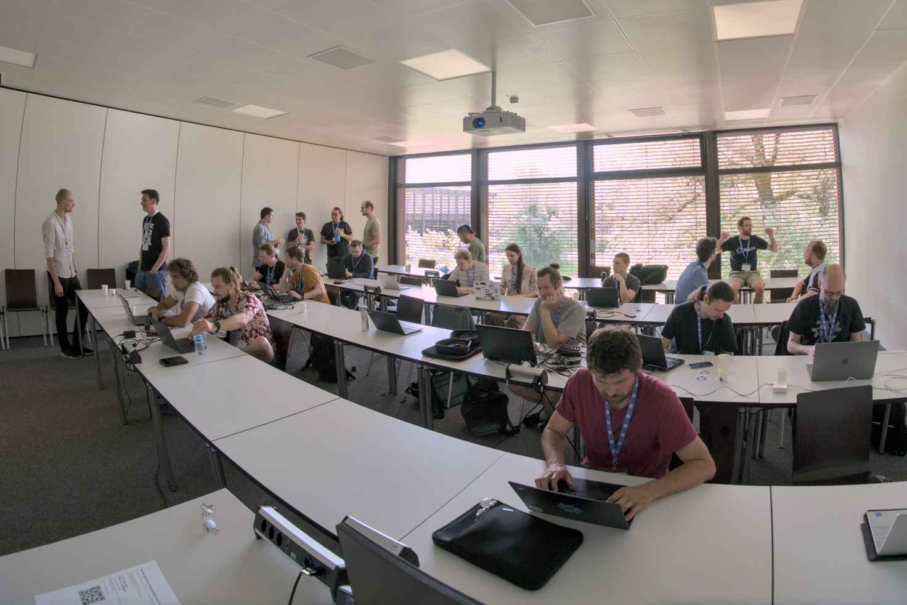
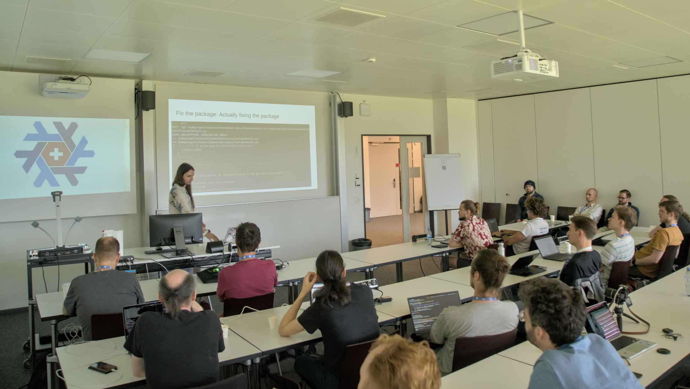
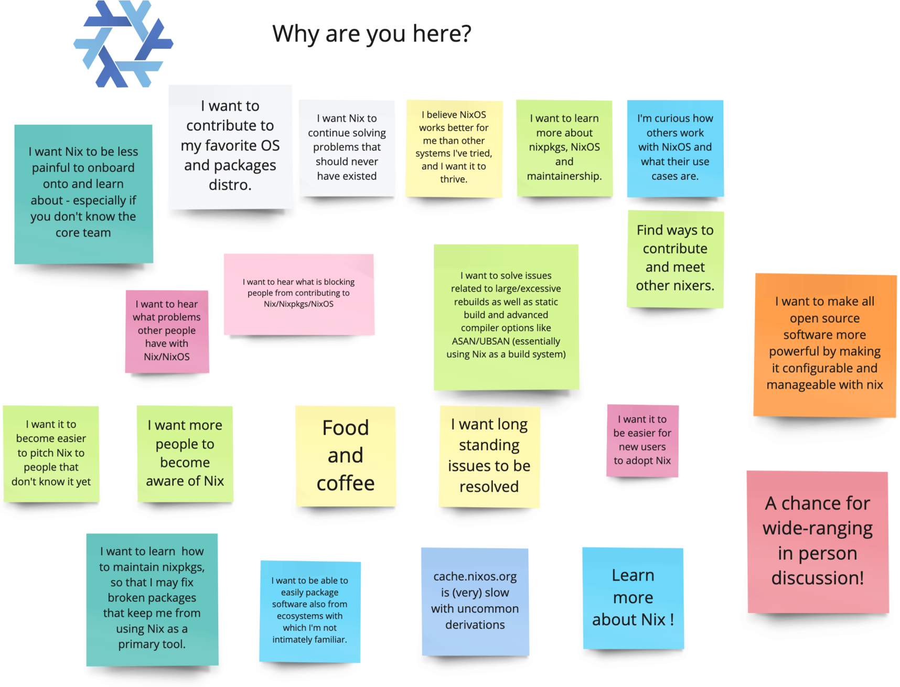
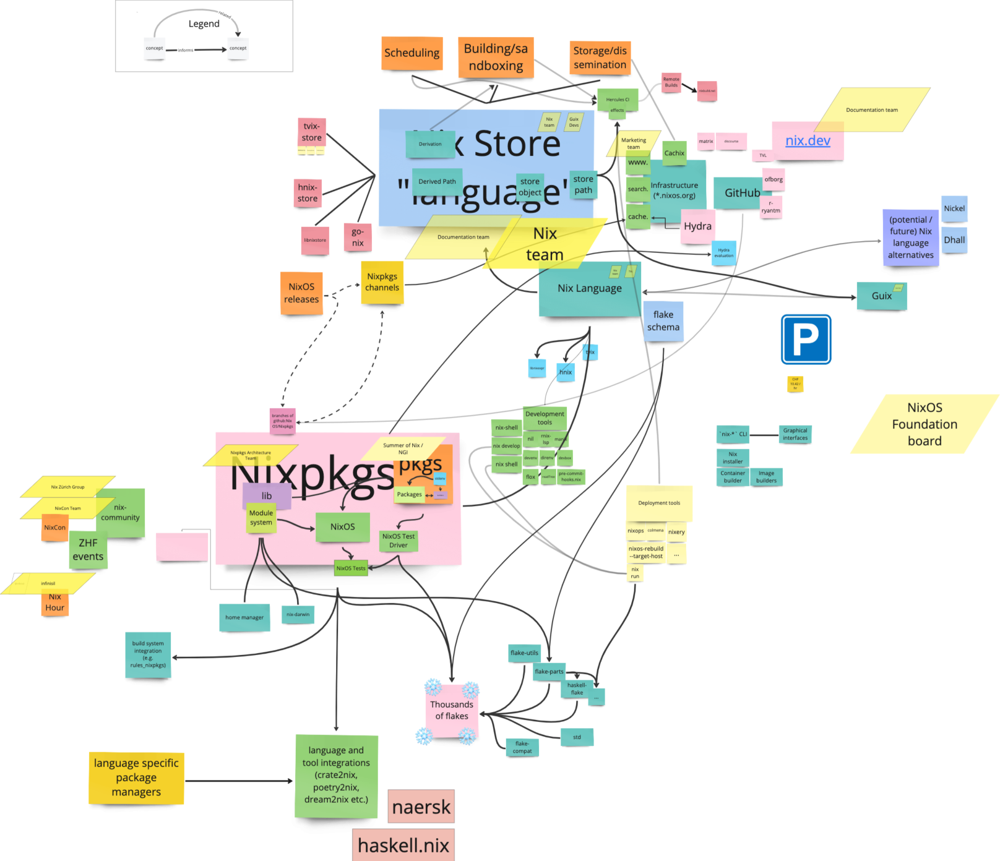
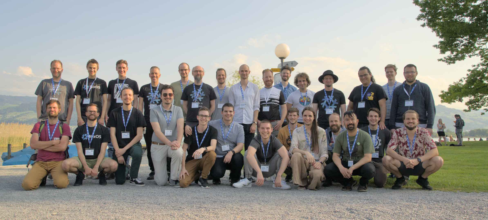
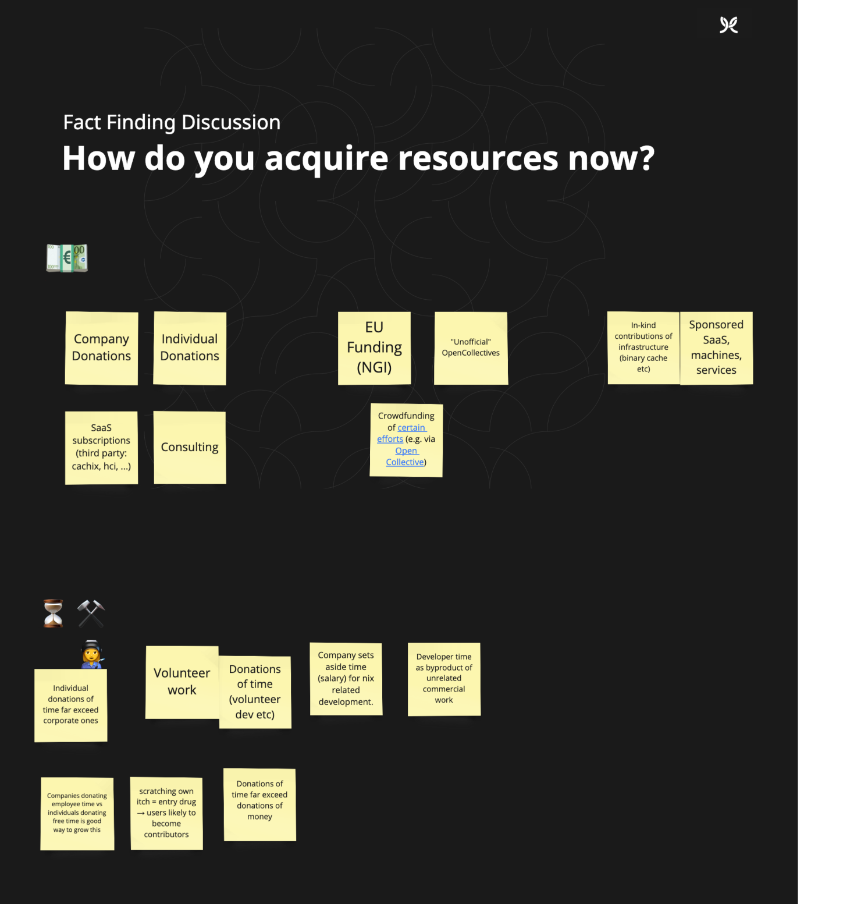
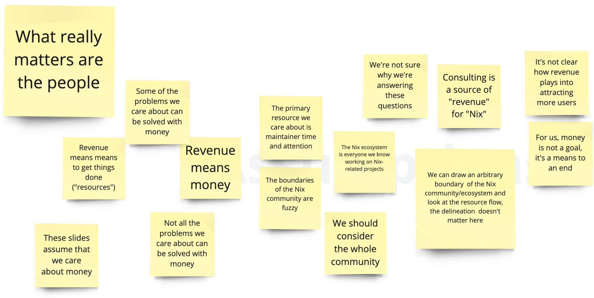

# Zürich ZHF Hackathon and Workshop report

On the last weekend of May 2023, the Zürich Friends of Nix hosted a multi-event around [ZHF 23.05](https://discourse.nixos.org/t/zero-hydra-failures-23-05-edition/27959).
It featured a hackathon, a Nix developer workshop, and a UX workshop, that all took place at [Eastern Switzerland University of Applied Sciences](https://www.ost.ch/) (OST) right next to Lake Zürich.

# Background and preparations

Both the Nix ecosystem and the community building it are experiencing noticeable growth in the past few years.
This is naturally accompanied by technical and coordination challenges, which are compounded by an increasing pace of developments due to influx of new users and contributors.
The distributed setting dominated by asynchronous communication often makes it hard to identify, keep track of, and tackle deeper or long-standing issues alongside development and maintenance tasks.
And most importantly, everyone involved has their own set of ideas about what’s important and how to do things.

Hallway and dinner table discussions at in-person events such as NixCon 2022 or the past [UX workshop in November 2022](https://discourse.nixos.org/t/2022-11-26-nix-nixpkgs-nixos-hackathon-in-zurich-rapperswil-jona/23402/11) give a rare glimpse into that mind space.
Such encounters not only inform many strategic decisions for individuals and organisations, but also allow forming social ties between the people involved.

The main motivation for a Nix developer workshop was to give some structure to these informal processes to make them more explicit, and therefore more approachable to those interested to participate and contribute.
Also, we were looking forward to continue UX workshop led by Elton Vecchietti, UX department lead at Modus Create, in order to address one of those major issues that is mainly facing *users,* as opposed to *contributors and maintainers*.
The upcoming 23.05 release provided a great opportunity to get together many people in one setting to work on these two complementary subjects.

Preparations started in February 2023 by outlining an agenda and moderation plan, sketching possible outcomes, and probing for interest among potential participants.
When it was clear that a substantial number of people would attend, we published an announcement and met regularly over a couple of weeks to refine the schedule to ensure that we would make best use of everyone’s time.
The agenda was designed such that participants would focus on the most important issues first, and be nudged to make decisions rather than having open-ended discussions.

The event spanned two long days interspersed with breaks, starting Saturday at 10:00 and ending at 19:00 with a group photo, and continuing on Sunday at 10:00 until 15:00 to be concluded with barbecue at the lakeside.



We had around 30 attendees on Saturday and 16 on Sunday, arriving from all over Europe, the USA and Japan, including: Nix principal author Eelco Dolstra (@edolstra), maintainers of core components John Ericson (@ericson2314), Robert Hensing (@roberth), Silvan Mosberger (@infinisil), major contributors David Hauer (@davhau), Niklas Hambüchen (@nh2), Florian Klink (@flokli), and many new and long-time users ranging from computer enthusiasts to senior software engineers.
We were also happy to see many people again who participated in the last hackathon.
The scheduled program was live-streamed on Jitsi, and had 2-3 viewers on Saturday.

The following is a summary of workshop proceedings and outcomes.

# Nix developer workshop

Saturday began a series of lightning talks to get participants up to speed with recent developments in the Nix ecosystem.
After a brief introduction by our host and event organiser Alex Drake reminding everyone that Nix is reached the impressive age of 20 years, Eelco presented what day-to-day Nix maintenance looks like (see the [maintainers’ directory in the Nix repository](https://github.com/NixOS/nix/tree/9c6ede85fc3cd822b5c6b56045ff231a61fcd55f/maintainers) for details), Valentin reported on what’s happening around the ongoing effort of improving documentation, and Silvan gave an overview of the process to fix build failures in Nixpkgs.



After a break for mingling, hacking, and consuming coffee and snacks prepared by the event organisation team, Alex and Valentin introduced the group to the day’s schedule and objectives:

- Collect individuals’ motivations and goals for working with Nix, as well as problems and issues that we see day to day, both to get in the mood and to set a course for the rest of the day
- Map out as much of the Nix ecosystem as possible and note who is taking care of what, to gain a shared understanding of the current situation
- Cluster the initially collected problems, and form working groups to develop plans to address them in the following 6 months
- Present and discuss results

Only two participants sat down to hack on ZHF after the break, and eventually joined the workshop.
Nonetheless, [7 ZHF pull requests](https://github.com/NixOS/nixpkgs/issues?q=ZurichZHF+created%3A%3E2023-05-25) were merged.



## A map of the Nix ecosystem

After overcoming the initial friction in working with the virtual sticky notes on [miro.com](http://miro.com), the group went on to address one of the major obstacles to contributors:
What’s there to begin with?
How do the various components and projects relate to each other?
Who is responsible for what?

The session was accompanied by some back and forth, moderators asking for clarifications, participants adding and re-arranging items.
A few, perhaps non-obvious, observations:

- While there is a flourishing periphery of tooling, many core components such as Hydra, the module system, and the Nixpkgs library, are not maintained consistently.
- The relative size and complexity in the depiction seems to correlate to how well workshop participants understand those components and how much importance they assign to them.
    - Maybe surprisingly for relative beginners who mostly interact with the ecosystem through NixOS or Nixpkgs, there is a lot going on around Nix itself.
- The existing maintainer teams are spread thin on large problem domains.
- Clearly, not all aspects are represented appropriately.
  For example, we had no representative of the infrastructure team or the marketing team to add their views to the whole.



Additional insights, in particular about the ecosystem surrounding Nix and Nixpkgs, can be gleaned from an interactive [Map of GitHub](https://anvaka.github.io/map-of-github/#10.76/11.2193/-8.4821).
It would be interesting to have a more detailed internal view based on data from `CODEOWNERS` files (for example for [Nix](https://github.com/NixOS/nix/blob/master/.github/CODEOWNERS), [Nixpkgs](https://github.com/NixOS/nixpkgs/blob/master/.github/CODEOWNERS), [nix.dev](https://github.com/NixOS/nix.dev/blob/master/.github/CODEOWNERS)) as well as Nixpkgs maintainer information (based on `[```maintainer-list.nix```](https://github.com/NixOS/nixpkgs/blob/master/maintainers/maintainer-list.nix)`, `[team-list.nix](https://github.com/NixOS/nixpkgs/blob/master/maintainers/team-list.nix)`, and the individual package declarations).

## Problem statements and working groups

After a short break, participants went back to the individual problem statements they compiled in the beginning, and clustered them by topic.
We phrased them as mission statements:

- Ease user onboarding
- Improve user retention
- Improve support for software developers
- Improve Nix ecosystem developer experience
- Satisfy the needs of commercial users


Prompted by the moderators, four working groups of roughly equal size formed around each subject of interest (except for “developer experience”).
The groups were tasked to refine their mission statement, determine their available capacity to do something about it, and devise a plan that could realistically be executed by that group within the next 6 months given their estimated capacity.
After a 90 minutes session and a 45 min break, the groups came back together to present results.
For that last session, moderators presented an additional challenge: Each group would not only report on the ideas they discussed and their action plan, but also ask for help they would need by others and answer any questions, before the other participants would be able pledge concrete support for that particular project.
Here are the outcomes:

## Commercial users

### Mission Statement

Make Nix/NixOS etc.
more appetising for commercial users: Provide stability, security and certification (inter alia).

<details><summary>What was discussed</summary>

Certification:

- e.g. FIPS
- Requires money, resources
- Hard to maintain, but very concrete
- Could be enabled by certification-specific (meta / high-level) NixOS-options. ("Make the system compliant to FIPS")
- Extend with auditing

Testing continuously:

- Many people use Nix on physical hardware devices and they don't want to have to worry about things breaking when they upgrade.
- Also finding Nix packages that don't yet have tests, automatically.
- One could enable an attribute in the system closure that would force all packages to have tests.

Bounty system for packaging requests:

- There could also be an upvoting system for packaging requests.
- ~~generate~~ [report](https://github.com/NixOS/nixpkgs/issues?q=is%3Aissue+is%3Aopen+sort%3Areactions-%2B1-desc+label%3A%220.kind%3A+packaging+request%22) of most-upvoted package requests.

"Canonical for NixOS":

- Maybe it would make sense to have a firm like Red Hat or Canonical that provides a commercial support and maintenance service for NixOS.
- On the NixOS website, there's already a [list of commercial support providers](https://nixos.org/community/commercial-support.html) (without implication of any blessing).

</details>

### 6-month plan

Move the "commercial support" section of the NixOS website to be more discoverable.

Ask commercial providers to specify their Nix-related offers.

<details><summary>Q&A</summary>

Have there been any thoughts about LTS?
The NixOS 6-month release cycle is too fast.

- It would be great to have, but you need people to support this.
Other projects that have LTS either have commercial entities supporting them or a much greater number of volunteers.

</details>

<details><summary>Pledges of Support</summary>

- @fricklerhandwerk will merge any PRs to move the commercial support page.
- @fricklerhandwerk will ask around at Tweag to make a more specific offer.
- @edolstra will ask around at DetSys
- @DavHau will ask around at Numtide.

</details>

## New user onboarding

### Mission Statement

Make it possible for people to learn how to use Nix without relying on an experienced person for help.

<details><summary>What was discussed</summary>

The biggest bottleneck is lack of maintainer capacity on the upstream side.
Asking companies for small amounts of employee time to work on documentation will not help with that.

The group discussed various approaches to incentivise or convince professionals and small companies to invest in the ecosystem.

</details>

### 6-month plan

Organise a fundraiser to build up the capacity for the documentation team to accept external contributions over an extended period of time:

- Group members will estimate the value (or savings) better onboarding would provide to their employers and prepare a pitch to encourage them sponsoring the documentation effort
- The pitches will be collected by the documentation team as a resource for other people to reference when they want to ask for support at their company.
- The documentation team will compile a public value proposition to fund the ongoing effort, for different types company use cases

<details><summary>Q&A</summary>

How will this lead to tangible improvements in 6 months?

- Feedback from pitching to companies will inform how to set priorities to use our available time for working on documentation more effectively.
  For instance, which use cases to focus on to save most time in onboarding.
- Continued funding will allow for time to work on large issues and ongoing maintenance, accommodating smaller contributions.
  We already have roadmap.

Should a wall of text be the outcome to onboard people, or should it be more practice-based, project-oriented, exercises, etc.?

- There's some work in the learning journey working group towards answering that question sensibly.
  Might need to be a more commercial offering though, which others implemented already

Should all four [Diátaxis](diataxis.fr/) quadrants be covered?

- Main goal (of the [currently-funded project](https://github.com/NixOS/nix.dev/blob/793206a5e656d063e4ac70bb550c5d3cf6f00c73/maintainers/documentation-project-2023.md)) is for contributions to tutorials and guides to fit in easier.
  Maintainers and contributors should see immediately where new content should go, so it becomes easier to help with small amounts of effort.

</details>

### Call for help

- If you work on companies not using Nix heavily yet, pitch the idea to leaders.
  Pitch it to friends and colleagues.

  Consider opportunity cost: What does it cost to onboard new users, when we can't rely on official documentation?
  How much time would it save if better documentation existed?
  (Half of the estimated cost might be a good amount to contribute towards improvement.)
  Remind leadership of the overall value proposition.
  In particular, determine how much time using Nix saves you with onboarding or switching projects, how that would improve if new hires or team members could get into Nix on their own, and how the company would benefit from reducing the amount internal Nix-related documentation to maintain.

- Share your pitch with the docs team.

  Each company might not be willing to sponsor much, but if we have 20 companies sponsoring a little, it will amount to more than just a little.
  The goal should be to get continuous funding, not just one-time.

- Include in job postings Nix as a technology used to improve developer experience, increase mindshare and adoption at the level of individuals

- Spread the word on the [Nix documentation fundraiser](https://opencollective.com/nixos/projects/documentation-project)

<details><summary>Pledges of Support</summary>

- Will pitch to their company:
    - @ners
    - @Nebucatnetzer
    - @DavHau
- @infinisil will keep being in the docs team and help with reviews

</details>

## User retention

### Mission Statement

Improve the lives of those using the Nix APIs (as consumers).
Keep advanced users that need to do outside-the-box stuff.

<details><summary>What was discussed</summary>

- Layer violations as sign of missing proper functionality
    - bad: `nix-shell` / `nix develop` knowing about Nixpkgs
    - good: a separate Nixpkgs tool
- Need more reviews
    - e.g.  @roberth's `[cleanAttrs` in Nixpkgs](https://github.com/NixOS/nixpkgs/pull/217243)
        - Fixes a 20-year-old problem (with opt-in)
    - e.g.  @infinisil’ [file set combinators](https://github.com/NixOS/nixpkgs/pull/222981/) (could use reviews)
        - goal is to provide a uniform, convenient interface to deal with large source trees
    - More people can review than write advanced PRs
        - If they review, maybe they can be the ones writing the advanced PR next time!
        - Don't have the same "elite group" writing and reviewing amongst themselves
- RFC 140 still needs testing
    - Currently an internal thing, but might become an API at some point
- Have to collect knowledge about pain points
    - e.g.  overriding in Nixpkgs is ad-hoc, Nixpkgs Architecture Team WG on modules is hoping to address this

</details>

### 6-month plan

- Encourage people to do reviews and share the deep knowledge
- Compile and maintain a list of [significant issues and PRs](https://github.com/NixOS/nixpkgs/labels/significant)
- Make an RFC to define a consistent notion of packages in Nixpkgs ([Package Modules Working Group](https://github.com/nixpkgs-architecture/pkgs-modules))
- Finish [RFC 140](https://github.com/NixOS/rfcs/pull/140)

<details><summary>Q&A</summary>

- How to figure out which things are *quick* for reviews?
    - None will be quick! But you can do a partial review or try-out/dog-food/QA instead.

</details>

### Call for help

- Review and test [significant issues and PRs](https://github.com/NixOS/nixpkgs/labels/significant),  [RFC 140](https://github.com/NixOS/rfcs/pull/140), and other work by the Nixpkgs Architecture Team
- Help bring attention to the call for reviews

<details><summary>Pledges of support</summary>

- @fricklerhandwerk will review @infinisil's [path library](https://github.com/NixOS/nixpkgs/pull/222981) and [file set combinators](https://github.com/NixOS/nixpkgs/pull/222981/) PRs
- @ericson2314 and @mrcjkb will do at least 1 review for every PR opened!

</details>

## Support for software developers

### Mission Statement

Make Nix a viable alternative for language-specific package managers (e.g.  Cargo) and other build systems (e.g.  Bazel)

<details><summary>What was discussed</summary>

Users and companies have different needs.
E.g.  large companies like Bazel for fast incremental builds.
Smaller companies care about reproducibility (e.g.  making their projects build on any developer's laptop).

Users currently have to make substantial changes to get their stuff to build with Nix.
This should be made easier.

Have to get Nix on people's radar as an alternative for tools like Bazel.
Currently Nix isn't even considered as a player in that space.

</details>

### 6-month plan

- @DavHau will continue [dream2nix](https://nix-community.github.io/dream2nix/) effort (automates packaging for various language ecosystems)
- @Ericson2314 will continue to work on [RFC 92](https://github.com/NixOS/nix/issues/6316) and [layered store](https://blog.replit.com/super-colliding-nix-stores), which should get us closer to Bazel.
- Sketch a plan to have tools agree on an action graph specification (e.g.
Cargo could produce a derivation-like graph)

### Call for help

- From `dream2nix`: Contribute your `<lang>2nix`, get in touch.

  If your company isn't using Nix yet because of lack of language tooling, approach us for help.
  `dream2nix` is currently good at Python and Javascript, Rust is in the works.

<details><summary>Pledges of support</summary>

- @edolstra: Discuss on the NixOS Foundation board how we get projects (e.g.  `dream2nix` or Home Manager) promoted to "official" status.
  Currently there is no process for that.
- @DavHau: Dig up @FridH’s notes from the [Python packaging roundtable](https://discourse.nixos.org/t/python-distributions-packaging-roundtable/27869) to get more visibility into how we could cater to the Python ecosystem
- @Nebucatnetzer: Test `dream2nix`

</details>

## Conclusions

The different groups each identified small changes that would make for a tangible improvement in their respective problem domains.

Many of the larger developments discussed are already ongoing and are likely to produce outcomes in the next months.
Pledges to help and the group’s additional feedback will hopefully support the efforts to go smoother.
The focused exchanges uncovered some dependencies, overlaps, and potential for collaboration.

For instance, there is an obvious opportunity for the documentation effort to improve onboarding with better language support provided by `dream2nix`, which in turn could contribute to improving quality of internal APIs in Nixpkgs;
although all of that is likely to only start panning out at the end of the year when there is a stable interface.
That, and many other endeavours, depends on more far-reaching issues such as what makes an “official” project and what exactly that means.

An issue that came up multiple times on various occasions was the ability of Nix ecosystem tools to cater to organisational users, and what better commercial support could entail:
more resources for maintenance and development;
better user experience overall;
possible conflicts of interest.

Notably, a recurrent pattern in the discussion was “it would of course be good, but someone needs to do it”.
There are multiple obvious and uncontroversial projects that would tangibly improve the overall ecosystem if implemented, but need a substantial amount of (presumably funded) effort as well as continued involvement by maintainers to get it upstream.
Due to time constraints, the plenum did not get to answering the questions around how to make those projects more likely to start and succeed.

The workshop provided a condensed overview of what is currently happening in the Nix ecosystem, an impression of the size of the respective tasks and available resources to work on them, and an opportunity to share plans and details among attendees.

We hope to reconvene with as many participants as possible in half a year, and give everyone an opportunity to show off their results.



# UX workshop

Event participants came back together on Sunday morning for the second iteration of Elton Vecchietti’s well-received UX workshop.

After breaking the ice by prompting attendees to imagine their professions in a universe without Nix – witnessing which is one of these rare privileges at in-person events – Elton presented evaluation of the last workshop’s outcomes and additional research performed by his team at Modus Create.
This time the goal was to refine and elaborate on the value proposition of the Nix ecosystem, to inform next steps for the UX experts and how they could support us in the future.

The group went on to explore the broader technology landscape in a competition analysis, to find out what we can learn from others.
It spurred lively debate, in particular about Chocolatey and Docker.
After that, proposals for longer-term improvements, supplied by the UX researchers, were evaluated by participants in terms of actionable items and blockers, concretely:

- Enhanced user experience
- Integration with cloud and container technologies
- Collaboration and ecosystem expansion
- Improved performance and scalability
- Integration with configuration management tools
- Cross-platform support
- Security and auditing

The following session then picked up on many of Saturday’s topics by framing them as resource problems.
The group was tasked to identify sources of “revenue” and think about “costs”, a vocabulary that clearly not everyone was comfortable with in the context of a free and open source software project mainly driven by volunteers.



Yet, it nudged everyone to make explicit their assumptions and open questions around what we even consider “resources”, “the ecosystem”, or “the community”, and more importantly, what it is that we really value (spoiler: it’s not money).



Two hours of focused work distilled, among other things, a sketch of a global mission statement – which due to the fairly small group and all the open questions can at best be considered a narrative device:

> Make Nix the default choice in software development.
> Make computers work in the long run.

The last session focused on narrowing down a value proposition for what we came to call the “Nix platform” (as opposed to the broader ecosystem).
Developing a language for that to begin with was a major part of the challenge.

While this did not yield firm decisions or action plans, and was (by design) quite detached from everyone’s day-to-day software development work, it was largely perceived as a valuable educational experience.
Most importantly, it helped everyone shape ideas about what exactly it is that we care about, what provides value to users and contributors in the Nix ecosystem, how we could go on communicating about that, and what we may focus on to make things better.

Elton had much, much more ground to cover.
Despite only scratching the surface due to limited time, we can expect that participants sharing their experience and insights, and the ideas that emerged making their way into our work, will already have an impact in the near-term future.
And most importantly, we’re very much hoping to continue these explorations in half a year.
Elton, thank you very much once again for your support and sharing your outstanding expertise!

# Acknowledgements

This event was made possible by Prof.  Dr.  Farhad Mehta, professor of informatics at the OST, by accommodating us in two large, modern computer rooms with a beautiful lake view.
Thanks a lot to Raffael Das Gupta (@das-g) for your support with the venue.
The event was sponsored by the NixOS Foundation, providing budget for food and drinks, and Modus Create’s Open Source Program Office lead by Mathieu Boespflug (@mboes), enabling Elton Vecchietti to run the UX workshop.

Thanks to all the participants for your attendance and active involvement, and for providing [detailed feedback on the event](https://github.com/nix-community/developer-workshop/issues/1) so we can make it even better next time.

# Looking ahead

We’re already set to organise the next event to keep up the momentum.
Save the date:

> Saturday 25th and Sunday 26th of November 2023

There will be much more hacking and knowledge sharing, longer breaks, better advance communication, and more lead time to prepare trips.
In particular, we hope to meet many participants again, to share and evaluate results.
We also want attract many more leading contributors from the Nix ecosystem, better learn to know each other, and work on hard problems together.
Subscribe to `[nix-community/developer-workshop](https://github.com/nix-community/developer-workshop)` to stay up to date with planning and preparations.
