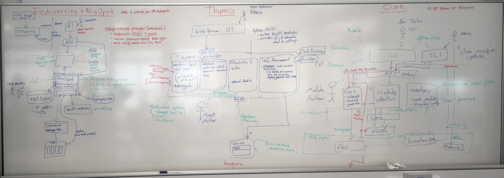
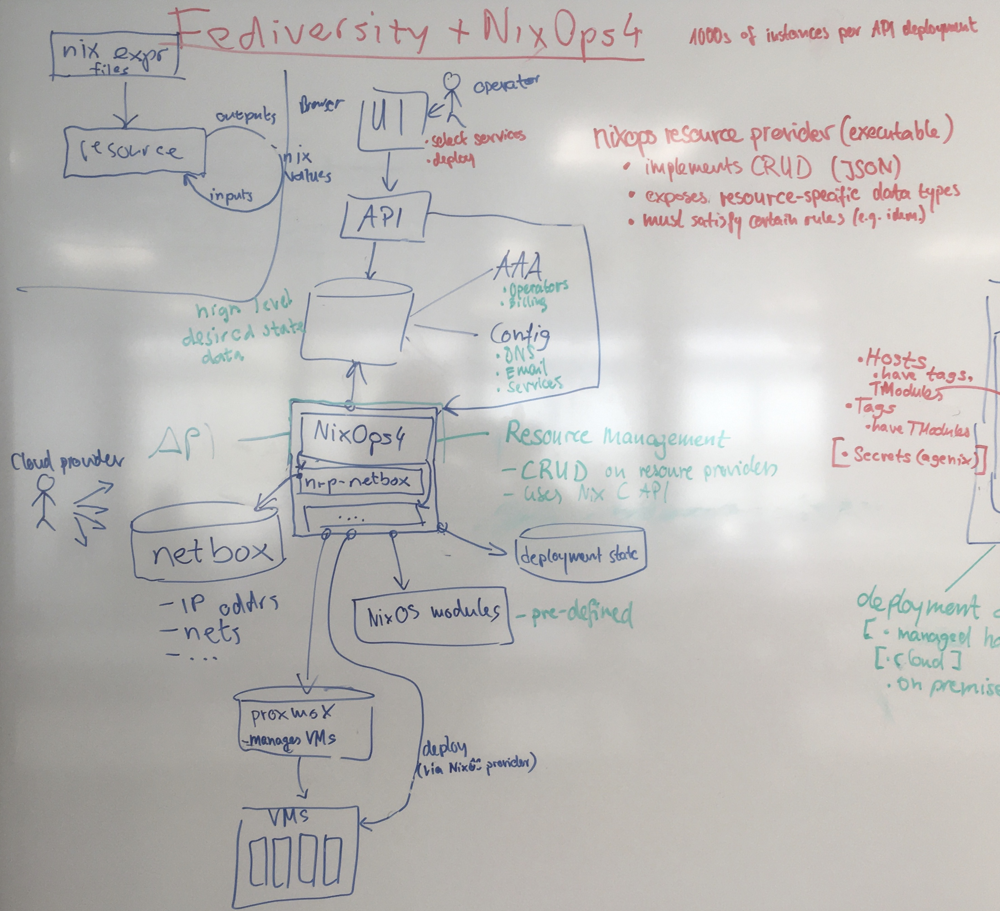
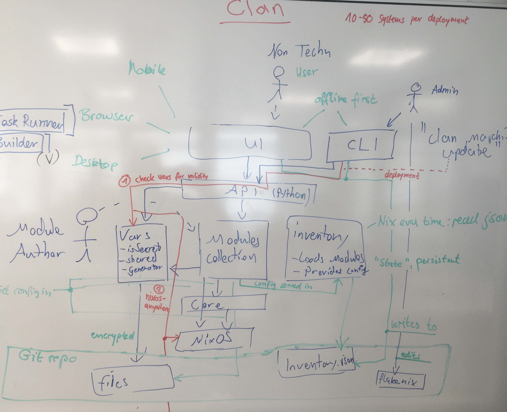
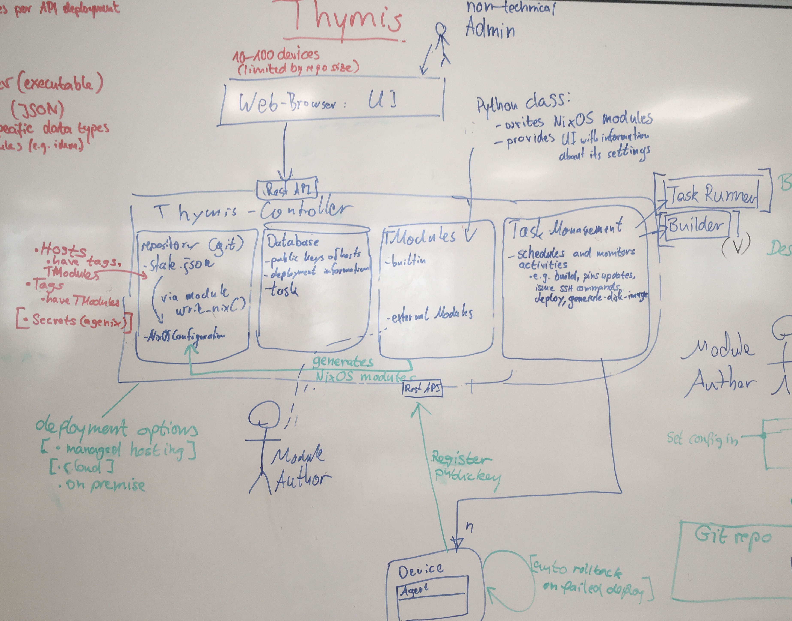
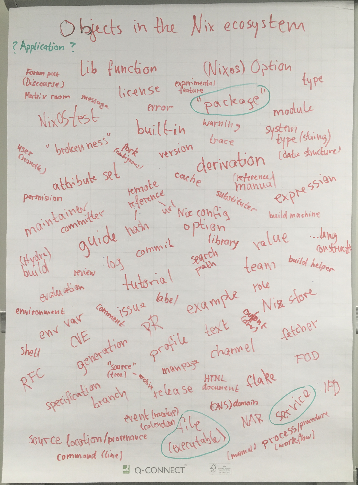

# Zurich 24.11 ZHF hackathon

On the last weekend of November 2024, the Zürich Friends of Nix hosted yet another two-day hackathon around the [Zero Hydra Failures release preparations for NixOS 24.11](https://discourse.nixos.org/t/lets-have-a-great-24-11-release-cycle/51549) at [Eastern Switzerland University of Applied Sciences](https://www.ost.ch/) (OST) right next to Lake Zürich.

These events are designed to encourage people to get to know each other, hack on everything Nix, and shape the future of open source together. We are proud to have hosted the fifth such event in a row.


# Background and preparations

Preparations started a month after the previous hackathon, by publishing [the report](https://discourse.nixos.org/t/2024-05-25-26-saturday-sunday-zhf-24-05-hackathon-ost-zurich-rapperswil-jona/45380/2), evaluating feedback, gathering ideas, and planning what needs to be done for the next event.

In particular we focused on enabling more people to contribute, welcoming new members to the community, better getting to know each other, and working on hard problems together. This primarily involved improving outreach and consistency of communication and reminders, in order to help get the right people together.

# Event

The event took place in two large classrooms and the hallway connecting them. It spanned Saturday and Sunday from 10:00 to 18:00. This time the organiser team was suprised to arrive to half a room full of people who already started hacking around 9:00.

We had more than 40 attendees on Saturday and around 30 on Sunday, arriving from Switzerland and all over Europe: France, Germany, the Netherlands, even as far as Iceland. We were glad to see several key people in the crowd: a release manager, a member of the [steering committee](https://github.com/NixOS/org/blob/main/doc/governance.md), multiple Nixpkgs maintainers and major contributors, [governance team members](https://nixos.org/community/#governance-teams), representatives of various companies operating in the Nix ecosystem, a few former and recent [Summer of Nix](https://github.com/ngi-nix/summer-of-nix) participants, as well as a number of beginners and more experienced contributors.

We were very happy to welcome an extraordinary number of people new to Nix as well as our regulars such as @infinisil, @roberth, @imincik, @gefla, @Nebucatnetzer and @das-g. We especially appreciated having @wegank, @tfc, @SynQ, @hsjobeki, and @erictapen around to share their expertise.

On Saturday:
- Alex (@ners) welcomed attendees
- Valentin (@fricklerhandwerk) provided an account of the history of governance in the Nix ecosystem, including the conclusion of the constitutional assembly and recent formation of the steering committee, finally answering [one of his first questions on Discourse](https://discourse.nixos.org/t/how-is-the-nix-project-governed/5294)
- Silvan (@infinisil) gave his traditional and ever-updated introduction to squashing bugs for ZHF, noting a record-number of Nixpkgs maintainers at the event to help with reviews and merging
- Robert (@roberth) presented his highly promising work on [NixOps4](https://github.com/nixops4/nixops4), now famously known as -- technically correct -- "a tool to do things"

Well-caffeinated, attendees clustered into groups working on or discussing various issues, summarised below.


Saturday's hacking ended with a group photo while discussions continued late into the evening over this edition's culinary feat: cheese fondue and Glühwein. On Sunday the hacking continued, with brave Nix evangelists who brought their friends or colleagues receiving their honorary T-shirts ("I'm a special snowflake" and "🪟🍎🐧❄ One of these things is not like the others" went out of stock quickly).

Over the weekend, the group [created 28](https://github.com/search?q=org%3ANixOS+ZurichZHF+created%3A2024-11-23..2024-11-25&type=pullrequests) and [closed 24](https://github.com/search?q=org%3ANixOS+ZurichZHF+closed%3A2024-11-23..2024-11-25&type=pullrequests) issues or pull requests, an all time high! At the time of writing, the event series resulted in [108 created](https://github.com/search?q=org%3ANixOS+ZurichZHF+created%3A%3C2025-01-19&type=pullrequests) and [105 concluded](https://github.com/search?q=org%3ANixOS+ZurichZHF+closed%3A%3C2025-01-19&type=pullrequests) contributions.

Both by the numbers and by the vibes, this was the greatest Nix event in Zürich so far.


# Discussions

- @tfc @SynQ @roberth @fricklerhandwerk had a fruitful exchange on increasing organisational maturity around the Nix community and what we would gain by striking a healthy balance between:
    - running predictable operations to solve large-scale problems, and
    - leaving room for experimantation to preserve and foster the community spirit that brought us here. 
- @SynQ talked with @infinisil and @elikoga about how a hosting provider can support the NixOS infrastructure team with hardware, in order to ease the migration off Equinix Metal.
- @tfc @elikoga @das-g shared thoughts about improving communication culture and raising the degree of professionalism in public exchanges.
- @maralorn organized [nix-output-monitor](https://github.com/maralorn/nix-output-monitor) issues into a [project board](https://github.com/users/maralorn/projects/1) and discussed various feature ideas for the future.
- @erictapen demoed the work-in-progress [Nixpkgs security tracker](https://tracker.security.nixos.org) to @zimbatm and @infinisil.
- @das-g looked into what would be needed to bump `python3Packages.pytest-rerunfailures` to its latest version (not for ZHF / NixOS 24.11, instead just to have it up-to-date in the rolling "`unstable`" channels), but filed the [PR](https://github.com/NixOS/nixpkgs/pull/358855) for that only after the event.
- @das-g helped / advised two or so first-time contributors with backporting fixes (= extracting the relevant changes as a patch), that upstream had published on their main branches but not released in a tagged version, yet. These fixes were needed to unbreak package builds for ZHF.
- @matthewcroughan continued hacking on his SCION setup

### Deployment systems exchange



@hsjobeki (Clan) @elikoga (Thymis), @roberth @SynQ @fricklerhandwerk (Fediversity): Each of us works on a framework that has NixOS deployments at its core and exposes a user interface for letting people orchestrate that. Every project has a slightly different user group and goal they ultimately want to achieve. The underlying technical challenges the we are facing have a big overlap.

We presented each of our architectures and how we aim to solve shared problems, to learn from each other, and to gain insights in fields that some of us have explored already. 

| | [Fediversity](https://www.fediversity.eu/) + [NixOps4](https://github.com/nixops4/nixops4) | [Clan](https://clan.lol/) | [Thymis](https://thymis.io) |
|-|-|-|-|
|Scope | Hosted services through VMs in the EU-cloud (NL) by a few semi/non-technical "operators" with the goal to provide sovereign services (office/peertube/etc.) to non-technical customers. | Self-hosting your own cloud or homelab by semi-technical people and providing services (office/peertube/etc.) to non-technical social individuals. | Managing IoT devices and services on those devices. UI Targets non-technical Admins that can manage their devices using modules written by technical authors. |
| "Controller" Environment| Cloud | Local / On-demand  | Cloud |
| Targeted number of machines per deployment (untested estimates) |  thousands  | <100 | hundreds |
| Bussiness model | Targeted at institutions; customers are supposed to pay for managed hosting  | Private funding | Pilot customers pay for the entire deployment being operational |
| Service "Modules" | Maintained by NixOS contributors; custom additions by Fediversity developers where needed | Maintained by NixOS contributors and Clan developers | Maintained by Thymis |
| Modules/Services Configuration | Custom GUI for operators, with deliberately reduced number configuration options that abstracts away deployment-specific aspects | Textual: flakes with flake parts | Web GUI generated from modules |
| Persistence format | Pluggable thanks to NixOps4; likely databases for customer-facing parameters | Text files in Git repo | Text files in Git repo |
| Architecture diagram |  |  |  |

### UX development

@maralorn brought up a UX issue with package search, which shows many broken Haskell packages, making a bad impression to Haskellers interested in Nix. Together with @inifisil @hsjobeki @das-g @erictapen we ended up mapping out the broader problem space, because it wasn't obvious which of the various possible interventions was the most sensible for users, also in terms of effort and impact. 

As a short-term fix there was no opposition to @maralorn's proposal that we should filter out broken packages by default but leave a possibility for showing them when needed. For the mid-term @infinisil suggested approaches to reduce the number of broken packages, such as automatically re-trying to build packages marked broken -- since that label may go out of date.

Long term we have more tricky problems to address, such as:
- search is currently not actively maintained
- we have many uncoordinated alternatives with varying support status and maturity
- generally too many entry points and "places", with inconsistent visuals and sometimes unclear ownership.

The group also identfied or rehashed systemic issues, such as lack of coherent vision, and inefficient, ineffective communication. Addressing those would help with tackling many of the related challenges.


@hsjobeki asked for a decision on what to do about the different rendering tools for documentation. @fricklerhandwerk remarked that we still have to clarify the [XY problem](https://en.wikipedia.org/wiki/XY_problem) in that regard, and that it may actually be the lack of structured data, lack of overview, and a poor collective insight into relative priorities.

As a result, together with @erictapen and @das-g we collected all object types in the ecosystem we could come up with. We verbally sketched their relationships and walked through some example interactions. This felt like a worthy continuation of the UX workshops with @eltonUX, who has taught us a lot. (@fricklerhandwerk and @eltonUX [made some preparations on the topic](https://discourse.nixos.org/t/ux-design-for-the-nix-portal/53746) but unfortunately it didn't work out to run another workshop this time.)

This immediately allowed us to formalize the well-known problem that search users are thrown for a loop when they search e.g. for `nginx`: One wants to "use an application", but gets a *derivation* that outputs an *executable* which in this case is not enough. One would actually need a *service* to be enabled through a *NixOS option*. One reason things are that way is that we currently can't even express the notion of "application" in Nixpkgs. Therefore (downstream) presentations of that data either naturally converge to a certain form, or would have to fight against the Nixpkgs data model to enable more fluent workflows.



### On user interfaces for NixOS configurations 

@hsjobeki and @infinisil worked out how NixOS-modules (options) could be rendered as a user-friendly UI. 

Problems downstream UI projects share:

- NixOS is a hard-to-work-with moving target, with options beeing renamed removed, changing behavior. Any abstraction on top of NixOS will likely fall apart if not maintained by the same people or continously kept in sync with downstream efforts.
- NixOS options cannot be set efficiently through a programmatically generated UI if they are not a subset of JSON.
- Generating a UI from NixOS options ends up looking like a JSON schema editor, not like an intuitive UI that non-technical people would appreciate.

To bridge that gap possible solutions could include options-metadata or type 'annotations' in Nix. We worked on option metadata, type merging, and improving `lib.types` as necessary preparation for that idea.

Example of the idea: options can be created in Nixpkgs or by anyone downstream. 

```nix
# Some NixOS-module
{...}: {
   # Example option to set an "admin".
   # Select one of the existing users or create a new one.
   options.admin = mkOption {
    type = types.annotated { uiElement = "UI:UsernameDropdown"; } types.str;
    meta.autocomplete = "config.users.users.username" 
    # Could provide the UI with information where to look
    # for "good" values without creating a bad dependency between option and config
  };
}
```

- https://github.com/NixOS/nixpkgs/pull/358906
- https://github.com/NixOS/nixpkgs/pull/341199
- ... other minor improvements on `lib.types`

This could solve a big portion of the problem already.

# Acknowledgements

This event was made possible by Prof. Dr. Farhad Mehta, professor of informatics at the OST, by accommodating us in a large, modern computer room with a beautiful lake view.

This event wouldn't be possible without the amazing event team around @ners and @john-rodewald. Great many thanks to
- @das-g for tending to the venue
- @matthewcroughan @maralorn @twesterhout @vkleen for preparing and schlepping supplies early in the morning

[Tweag](https://tweag.io), the Modus Create Open Source Program Office lead by Mathieu Boespflug (@mboes), and [Antithesis](https://antithesis.com), thanks to their ongoing sponsoring, enabled @infinisil participate as part of his work on the Nix ecosystem. The attendence of @roberth @SynQ and @fricklerhandwerk was supported by the European Commission's [NGI initiative](https://ngi.eu/) and [NLnet](https://nlnet.nl) through the [Fediversity project](https://fediversity.eu/).

Thanks to all the participants for your attendance and active involvement, and for providing [detailed feedback on the event](https://github.com/nix-community/developer-workshop/issues/7) so we can make it even better next time.

And last but not least, many thanks to NixOS 24.11 release managers @RossComputerGuy and @wegank for another great edition of our favorite Linux distribution!

# Looking ahead

The next event is already in the making, save the date:

> Saturday 24rd and Sunday 25th of May 2025

Next time we want to make it even easier for people to work together on things they're interested in and to welcome many more new members to the community. We hope to meet all of you again!

For up-to-date information, check the [Nix Zürich user group](https://zurich.nix.ug/) website.

You can also follow news shared on these channels:
- [Zürich friends of Nix at meetup.com](https://www.meetup.com/nix-zurich/)
- Official Matrix room at [#zurich:nixos.org](https://matrix.to/#/#zurich:nixos.org)
- [NixOS Discourse *Events* category](https://discourse.nixos.org/c/events/13)
- [`nix-community/developer-workshop`](https://github.com/nix-community/developer-workshop)
